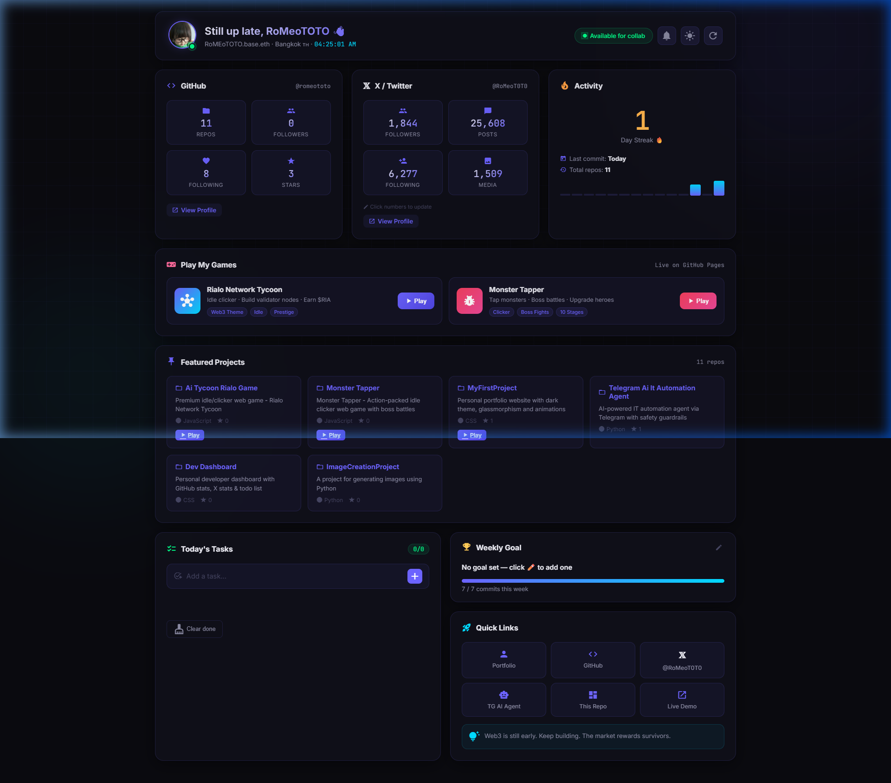

<div align="center">


<i>👉 <a href="README-th.md">🇹🇭 อ่านรายละเอียดภาษาไทย</a></i><br><br>

[](https://romeototo.github.io/dev-dashboard/)
[](https://github.com/romeototo)
[](https://x.com/RoMeoT0T0)

</div>

---

## 📸 Screenshot



---

## ✨ Features

|         Feature          | Description                                        |
| :----------------------: | -------------------------------------------------- |
|   📊 **GitHub Stats**    | Live data via GitHub API — repos, followers, stars |
| 𝕏 **X / Twitter Stats**  | Editable stats saved to localStorage               |
|   🔥 **Commit Streak**   | Visual activity bar graph + streak counter         |
|  🎮 **Game Shortcuts**   | One-click launch to Rialo Tycoon & Monster Tapper  |
|     ✅ **Todo List**     | Daily tasks with done/delete, persisted locally    |
|    📅 **Weekly Goal**    | Set weekly commit target with live progress bar    |
|  🔔 **Commit Reminder**  | Browser notification at your chosen time           |
| 🌙 **Dark / Light Mode** | Toggle theme, saved to localStorage                |
|    🔗 **Quick Links**    | All projects accessible in one click               |
|     💡 **Daily Tip**     | Rotates dev wisdom daily                           |

---

## 🚀 Getting Started

**Option 1 — Open directly (no server needed for basic use)**

```bash
open index.html
```

**Option 2 — Run local server (recommended for API features)**

```bash
python -m http.server 8080
# Then open: http://localhost:8080
```

**Option 3 — Use Live Demo**  
👉 [https://romeototo.github.io/dev-dashboard/](https://romeototo.github.io/dev-dashboard/)

---

## 🛠️ Tech Stack


- **Zero dependencies** — Pure HTML/CSS/JS, no frameworks
- **GitHub REST API** — Live public stats, no auth required
- **localStorage** — All user data persisted locally
- **Web Notifications API** — Browser-native reminder system

---

## 📁 Project Structure

```
dev-dashboard/
├── index.html      # Main dashboard layout
├── style.css       # Dark/Light theme with CSS variables
├── script.js       # GitHub API, Todo, Goal, Reminder logic
└── screenshot.png  # Dashboard preview
```

---

## 🔧 Customization

To use this as your own dashboard, edit these constants in `script.js`:

```javascript
const GH_USER = "your-github-username"; // Your GitHub username
const PLAY_LINKS = {
  "your-repo-name": "https://your-live-url.com/",
};
```

---

<div align="center">

### 🎮 My Games

|     | Game                                        |                            Play                             |
| :-: | ------------------------------------------- | :---------------------------------------------------------: |
| 👾  | **Monster Tapper** — Clicker + Boss Battles |    [▶ Play](https://romeototo.github.io/monster-tapper/)    |

---

Built with ❤️ by [RoMEoTOTO.base.eth](https://github.com/romeototo) · Bangkok 🇹🇭


</div>
